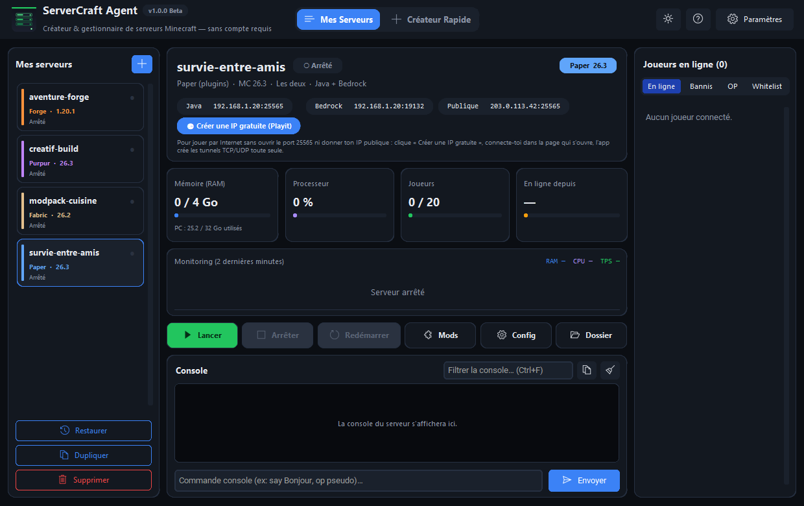
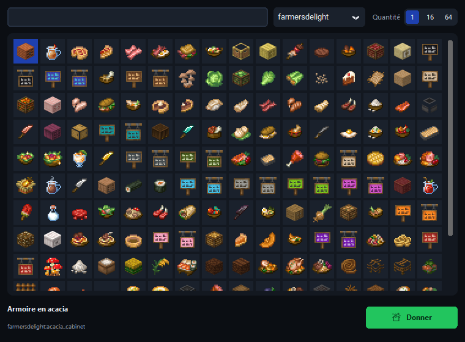
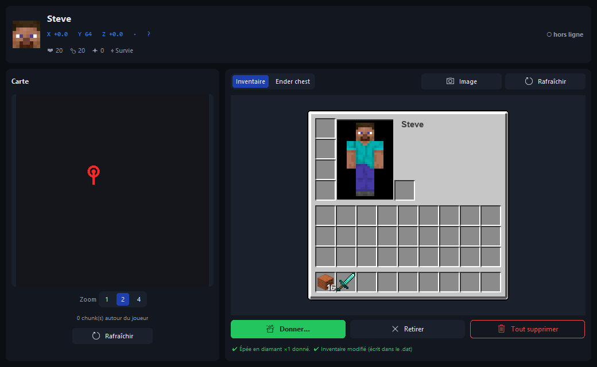
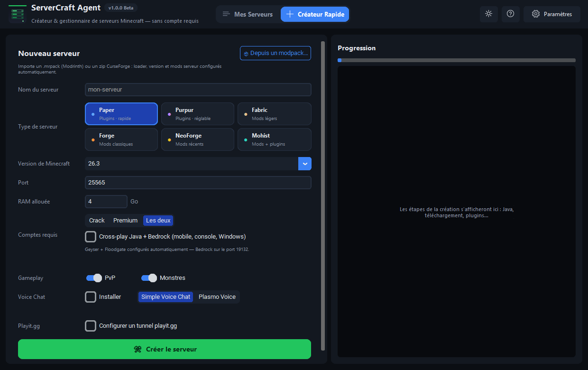
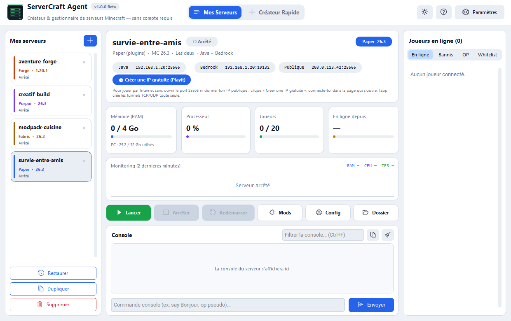

# ServerCraft Agent

**Créer, lancer et administrer des serveurs Minecraft depuis une seule
application Windows — sans ligne de commande et sans compte.**

ServerCraft Agent télécharge le serveur, Java et les mods à ta place, puis te
donne un tableau de bord pour tout piloter : console, joueurs, inventaires,
sauvegardes, tunnels pour jouer avec des amis sans ouvrir de port.



| Donner un objet (mods compris) | Inventaire d'un joueur |
|---|---|
|  |  |

| Créateur de serveur | Thème clair |
|---|---|
|  |  |

> Les captures sont dans `docs/screenshots/` (`serveurs.png`,
> `catalogue.png`, `inventaire.png`, `createur.png`, `theme-clair.png`).
> Elles ne contiennent que des données fictives. Pour les remplacer,
> dépose une image du même nom au même endroit.

## En bref

- **6 types de serveurs** : Paper, Purpur (plugins), Fabric, Forge, NeoForge
  (mods), Mohist (mods + plugins) — versions lues en direct sur les sites
  officiels.
- **Tout est automatique** : `server.jar`, Java adapté à la version (JRE
  Temurin téléchargé si besoin), EULA, `server.properties`.
- **Mods et plugins** façon launcher : recherche Modrinth et CurseForge,
  fiche détaillée, choix de version, import de modpack.
- **Jouer avec des amis** : IP gratuite Playit.gg créée par l'app, cross-play
  Java + Bedrock (Geyser, Floodgate, ViaVersion), Voice Chat.
- **Administration** : console, joueurs, bannis, opérateurs, whitelist,
  inventaires modifiables, mini-carte, sauvegardes, tâches planifiées,
  détection de crash, notifications Discord.
- **6 langues** (français, anglais, russe, japonais, espagnol, allemand),
  thème clair ou sombre.
- **Aucune télémétrie, aucun compte** : tout reste sur ton PC.

## Installation

### Option 1 — Installateur Windows (.msi)

Télécharge `ServerCraftAgent-x.x.x-win64.msi` depuis la page
[Releases](../../releases) et double-clique : **aucun droit administrateur
requis** (installation par utilisateur). Un raccourci est créé sur le Bureau
et dans le menu Démarrer.

Les serveurs, réglages et sauvegardes sont rangés dans
`%LOCALAPPDATA%\ServerCraftAgent` ; ils sont conservés d'une version à
l'autre.

### Option 2 — Depuis les sources

Prérequis : **Windows 10 ou 11**, **Python 3.10+** (testé avec Python 3.11).

```bash
pip install -r requirements.txt
python main.py
```

Java est détecté automatiquement ; s'il est absent ou trop ancien pour la
version de Minecraft choisie, un JRE Temurin est téléchargé dans `runtimes/`.

## Fonctionnalités

### Créer un serveur
- Type, version, port, RAM, comptes acceptés (Premium, Crack ou les deux),
  PvP, monstres.
- Comptes « Les deux » : **AuthMe** (plugins) ou **EasyAuth** (Fabric) est
  installé automatiquement pour que personne ne vole un pseudo.
- **Depuis un modpack** : `.mrpack` (Modrinth) ou zip CurseForge — loader,
  version et mods serveur repris du pack, mods client ignorés.
- **Voice Chat** : Simple Voice Chat ou Plasmo Voice.
- **Cross-play Bedrock** : Geyser, Floodgate et ViaVersion (ViaFabric sur
  Fabric) installés et configurés seuls (UDP 19132). Sur Forge, NeoForge et
  les anciennes versions, **ViaProxy** traduit la version : les joueurs
  Bedrock entrent quelle que soit la version du serveur. Geyser se met à
  jour à chaque démarrage, en même temps que Bedrock.
- Chaque version de Minecraft est lancée avec **le Java qu'il lui faut**
  (Java 8 pour 1.16.5 et avant, 17, 21 ou 25 ensuite), téléchargé si besoin.

### Mes Serveurs
- **Tableau de bord** : état, adresses à copier d'un clic, RAM, CPU, joueurs,
  durée en ligne, graphique temps réel (TPS sur Paper/Purpur).
- **Console** : coloration des erreurs, envoi de commandes avec
  **historique** (↑ / ↓), **filtre**, copie et effacement.
- **Joueurs** : en ligne, bannis, opérateurs et **whitelist** — tout
  fonctionne serveur lancé ou arrêté.
- **Fiche joueur** : mini-carte du monde, position exacte, **inventaire
  façon jeu** avec les textures officielles. On peut retirer un objet, tout
  supprimer (avec confirmation) et **déplacer les objets par
  glisser-déposer**, que le joueur soit connecté ou non.
- **Donner un objet comme en créatif** : catalogue de tous les objets du jeu
  **et des mods installés sur le serveur**, avec leurs textures et leur nom
  traduit, recherche, quantité 1 / 16 / 64, double-clic pour donner.
- **Sauvegardes** : avant chaque arrêt, à intervalle régulier, à la demande ;
  restauration en un clic.
- **Dupliquer** un serveur (monde, mods, configs) sur un port libre pour
  tester sans risque.
- **Tâches planifiées** : redémarrage quotidien annoncé en jeu, commandes
  programmées.
- **Détection de crash** avec relance proposée ou automatique.
- Si le port est déjà utilisé, l'app le dit avant de lancer et nomme le
  programme qui l'occupe.

### Mods & plugins
- Recherche **Modrinth** (sans clé) et **CurseForge** (avec ta clé).
- Installation dans `mods/` ou `plugins/` selon le serveur ; une nouvelle
  version **remplace** l'ancienne au lieu de créer un doublon.
- Les **dépendances obligatoires** sont installées avec le mod (Fabric API,
  ViaFabric…) ; seules les versions faites pour ce type de serveur et cette
  version de Minecraft sont proposées ; les mods 100 % client sont écartés.
- Bouton **« Vérifier »** : repère les fichiers qui empêchent le serveur de
  démarrer (mod client, mod d'un autre loader, autre version de Minecraft,
  plugin trop récent pour son Java) et les **désactive sans les
  supprimer**. Les mêmes problèmes sont signalés dans la console au
  lancement.
- Import de modpack avec tri automatique mods client / mods serveur.

### Playit.gg — une adresse sans ouvrir de port
Bouton **« Créer une IP gratuite »** : l'app relie ton compte Playit dans le
navigateur (une seule fois), crée les tunnels TCP et UDP nécessaires, lance
l'agent avec le serveur et affiche l'adresse à donner à tes amis. Un éditeur
manuel de tunnels reste disponible dans ⚙ Config.

### Paramètres
Langue, thème clair ou sombre, **couleur de l'interface** (bleu, émeraude,
violet, orange, rose), fenêtre d'administration au lancement, graphique de
monitoring, notifications Discord (webhook), compte Playit, clé CurseForge,
Agent IA (bêta, désactivé par défaut).

### Raccourcis clavier

| Raccourci | Action |
|---|---|
| `Ctrl + N` | Nouveau serveur |
| `F5` / `Maj + F5` | Lancer / arrêter le serveur sélectionné |
| `Ctrl + R` | Redémarrer |
| `Ctrl + L` | Aller au champ de commande |
| `↑` / `↓` | Commandes précédentes / suivantes |
| `Ctrl + F` | Filtrer la console |
| `Ctrl + ,` | Paramètres |
| `F1` | Aide |

Dans la fiche joueur : glisser pour déplacer un objet, clic droit ou `Suppr`
pour le retirer.

## Clé API CurseForge

Modrinth fonctionne sans clé. Pour CurseForge, chaque utilisateur met **sa
propre clé**, gratuite, créée sur
[console.curseforge.com](https://console.curseforge.com) :

- dans ⚙ Paramètres (bouton **Tester** pour la vérifier), ou
- dans la variable d'environnement `CURSEFORGE_API_KEY`.

La clé est enregistrée dans `data/settings.json`, sur ton PC uniquement ; ce
fichier est exclu du dépôt git. Aucune clé n'est livrée avec l'application :
les conditions de l'API CurseForge interdisent de partager une clé.

## Développement

```bash
pip install -r requirements-dev.txt
python -m pytest            # tests : sans réseau, sans Java, données isolées
python -m compileall -q app # vérification de syntaxe
```

### Construire l'installateur .msi

```bash
pip install cx_Freeze
python setup.py bdist_msi
# -> dist/ServerCraftAgent-<version>-win64.msi
```

Le numéro de version est défini une seule fois, dans `app/__init__.py`.

### Structure

```
main.py                  # point d'entrée
app/
  __init__.py            # __version__
  config.py              # chemins + settings.json
  i18n.py                # traductions FR/EN/RU/JA/ES/DE
  ai/                    # Agent IA (bêta) : providers, agent, modération
  core/                  # logique, sans interface
    server_manager.py    # création, process, console, crash, duplication
    downloader.py        # versions + jars des 6 loaders
    java.py              # détection de Java, JRE Temurin
    mods.py modpack.py   # Modrinth, CurseForge, modpacks
    playerdata.py        # inventaires : fichier .dat et commandes
    worldmap.py item_icons.py   # mini-carte, icônes d'objets
    backups.py scheduler.py     # sauvegardes, tâches planifiées, monitoring
    playit.py tunnels.py crossplay.py discord.py
    banlist.py ranks.py players.py properties.py server_net.py
  ui/                    # CustomTkinter
    app_window.py        # fenêtre principale, paramètres, aide
    tab_servers.py tab_creator.py tab_ai.py
    server_window.py server_settings.py mods_manager.py
    player_card.py inventory_view.py item_catalog.py players_panel.py
    theme.py feedback.py # couleurs, icônes, notifications
tests/                   # pytest
docs/screenshots/        # captures du README
```

## Notes

- **online-mode=false** quand les comptes crack sont acceptés : les joueurs
  rejoignent sans compte acheté (pratique en LAN ou via Playit).
- Forge et NeoForge sont lancés comme le fait `run.bat` ; la RAM passe par
  `user_jvm_args.txt`, généré automatiquement.
- Les textures de l'inventaire ne sont pas embarquées : elles sont extraites
  du client Minecraft officiel, téléchargé une fois depuis les serveurs de
  Mojang.
- ServerCraft Agent n'est affilié ni à Mojang ni à Microsoft.

Historique des versions : [CHANGELOG.md](CHANGELOG.md).
